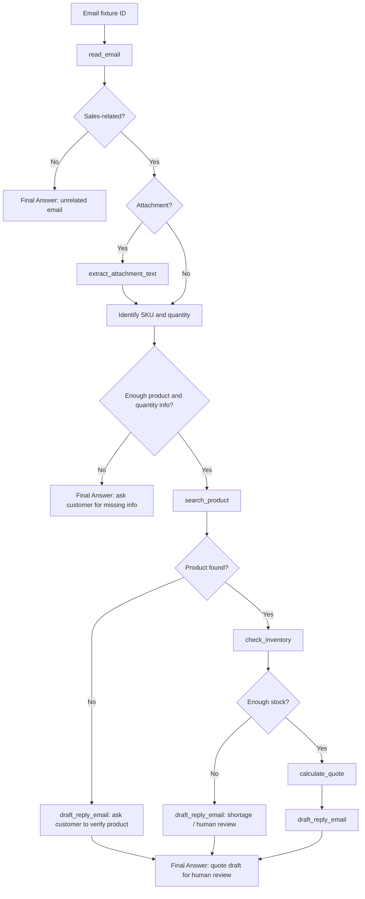

# Group Report: Lab 3 - Sales Mail ReAct Agent

- **Team Name**: Solo Sales Mail Agent
- **Team Members**: Nguyễn Bách Điệp - 2A202600535
- **Deployment Date**: 2026-06-01
- **Primary Model**: OpenAI `gpt-4o-mini`

---

## 1. Executive Summary

We built a Sales Mail Agent that processes simulated customer emails for quote and order requests. The email source is local fixture data, but the reasoning model is the real OpenAI `gpt-4o-mini` API. The agent reads the email, extracts attachment text when needed, checks catalog/inventory/pricing tools, calculates VAT-inclusive quotes, and drafts a reply for human review.

- **Final agent success rate**: 6/6 scenarios completed with the expected behavior.
- **Baseline chatbot result**: generated polite replies but could not verify catalog, stock, attachment contents, or quote totals.
- **Key outcome**: ReAct won on operational workflows because every price/stock decision was grounded in tool observations.

---

## 2. Architecture, Tools, and ReAct Flow

### ReAct Flow

```text
Email ID -> read_email -> Thought -> Action -> Observation -> ... -> Final Answer
```



All steps are logged as JSON events in `logs/2026-06-01.log`:

- `CHATBOT_BASELINE_END`: baseline output.
- `AGENT_STEP`: model reasoning/action/final answer.
- `AGENT_TOOL_CALL`: tool name, raw args, observation.
- `LLM_METRIC`: token usage and latency.
- `AGENT_END`: final steps/tool-call count.

### Tool Inventory

| Tool | Purpose |
| :--- | :--- |
| `read_email` | Load local email fixture by ID. |
| `extract_attachment_text` | Read text-like attachments such as CSV RFQ files. |
| `search_product` | Search catalog by SKU/name/alias. |
| `check_inventory` | Verify stock for a requested SKU and quantity. |
| `calculate_quote` | Calculate subtotal, discount, VAT, and total from tool-backed data. |
| `draft_reply_email` | Create a Vietnamese reply draft for human review. |

### Tool Design Evolution

| v1 Issue | Evidence | v2 Fix | Result |
| :--- | :--- | :--- | :--- |
| Draft reply context could be generic or English. | Early runs could pass placeholder context such as `quote summary` into `draft_reply_email`. | Added a prompt rule requiring complete Vietnamese customer-facing context and normalized common placeholder/English contexts inside the draft tool. | Final outputs are Vietnamese and quote details are grounded in tool observations. |
| Agent could be tempted to quote with incomplete request data. | `email_003` asks for camera AI pricing but gives no quantity. | Added rule: missing SKU/name or quantity must produce a clarification request. | `email_003` stops without calling `calculate_quote`. |
| Attachment requests could be answered generically. | Baseline for `email_004` could not inspect the CSV attachment. | Added attachment-first rule and `extract_attachment_text` tool. | `email_004` reads the CSV and quotes both line items. |
| Technical model failures were not explicitly documented. | Lab evaluation mentions parser errors and hallucinated tools. | Added tests for parser recovery and unknown-tool structured errors. | `tests/test_agent_failures.py` verifies both guardrails. |

---

## 3. Evaluation Results

Final command:

```bash
python scripts/run_sales_mail_demo.py --provider openai --model gpt-4o-mini
```

Output file:

```text
report/sales_mail_demo_results.json
```

Test evidence:

```text
python -m pytest -q
12 passed, 1 skipped
```

### Scenario Results

| Email | Scenario | Baseline Result | ReAct Agent Result | Steps | Tool Calls | Winner |
| :--- | :--- | :--- | :--- | ---: | ---: | :--- |
| `email_001` | Quote 50 `AI-CAM-200` | Could not verify price/stock. | Quoted `130,625,000 VND` with VAT and discount. | 6 | 5 | Agent |
| `email_002` | Order 4 `IOT-GW-500` | Asked for manual confirmation. | Confirmed stock and quoted `18,480,000 VND`. | 6 | 5 | Agent |
| `email_003` | Missing quantity for camera AI | Asked for more details. | Asked for product/quantity, did not invent quote. | 3 | 2 | Draw |
| `email_004` | RFQ in attachment CSV | Could not inspect attachment. | Read CSV and quoted both SKUs. | 8 | 7 | Agent |
| `email_005` | Marketing seminar email | Replied politely to non-sales email. | Classified as unrelated; no pricing tools used. | 2 | 1 | Agent |
| `email_006` | Unknown product `ROBOT-X9` | Asked salesperson to verify. | Searched catalog and reported product not found. | 4 | 3 | Agent |

### Telemetry Summary

| Metric | Baseline | ReAct Agent |
| :--- | ---: | ---: |
| LLM requests | 6 | 29 |
| Total tokens | 1,329 | 25,191 |
| Average tokens/request | 222 | 869 |
| Total model latency | 16,002 ms | 98,362 ms |
| Average latency/request | 2,667 ms | 3,392 ms |
| Total ReAct steps | N/A | 29 |
| Average ReAct steps/task | N/A | 4.83 |
| Total tool calls | N/A | 23 |

Interpretation: the ReAct Agent costs more tokens and latency because it performs multi-step verification, but it produces operationally usable answers for catalog, stock, pricing, and attachment tasks.

---

## 4. Trace Quality and Failure Analysis

### Successful Trace: Attachment RFQ

Input: `email_004`, RFQ with `data/attachments/rfq_delta.csv`.

Trace artifact: `report/traces/success_trace_email_004.md`

Observed ReAct path:

```text
read_email(email_004)
extract_attachment_text(data/attachments/rfq_delta.csv)
check_inventory(SENSOR-TEMP-10, 30)
check_inventory(IOT-GW-500, 3)
calculate_quote(SENSOR-TEMP-10, 30)
calculate_quote(IOT-GW-500, 3)
draft_reply_email(...)
Final Answer
```

Why it matters: the baseline could not inspect the attachment, while the agent converted the CSV into quoteable line items.

### Failure/Guardrail Trace: Missing Quantity

Input: `email_003`, asking for camera AI pricing without quantity.

Trace artifact: `report/traces/failure_trace_missing_quantity.md`

Observed ReAct path:

```text
read_email(email_003)
search_product(camera AI)
Final Answer: ask customer for product/quantity details
```

The agent intentionally did not call `calculate_quote`, preventing a hallucinated quote.

### Failure/Guardrail Trace: Unknown Product

Input: `email_006`, requesting `ROBOT-X9`.

Trace artifact: `report/traces/failure_trace_parser_or_tool_not_found.md`

Observed ReAct path:

```text
read_email(email_006)
search_product(ROBOT-X9)
Observation: product_not_found
draft_reply_email(...)
Final Answer: ask customer to verify product name/details
```

The agent handled catalog miss safely instead of inventing price or stock.

### Technical Failure Trace: Parser Error / Hallucinated Tool

Trace artifact: `report/traces/failure_trace_parser_or_tool_not_found.md`

The agent also handles two technical failures:

- If the model output has no valid `Action:` or `Final Answer:`, the agent logs `AGENT_PARSE_ERROR`, appends a parser observation, and gives the model a chance to recover.
- If the model calls an unregistered tool, the agent returns a structured `tool_not_found` observation instead of crashing.

These cases are covered in `tests/test_agent_failures.py`.

---

## 5. Production Readiness and Future Improvements

- The system creates a draft reply only; it does not send email automatically.
- Catalog, inventory, and pricing are local mock data in this lab but are isolated behind tools, so they can be replaced with ERP/CRM APIs.
- Real deployment should replace `read_email` with Gmail API, Microsoft Graph API, or IMAP.
- Attachment support should be expanded from CSV/TXT/JSON to PDF, DOCX, XLSX, and OCR for scanned documents.
- Add malware scanning, file-size limits, prompt-injection checks, and approval rules for high-value quotes.
- Add real pricing cost tables instead of the mock `cost_estimate` formula in telemetry.
